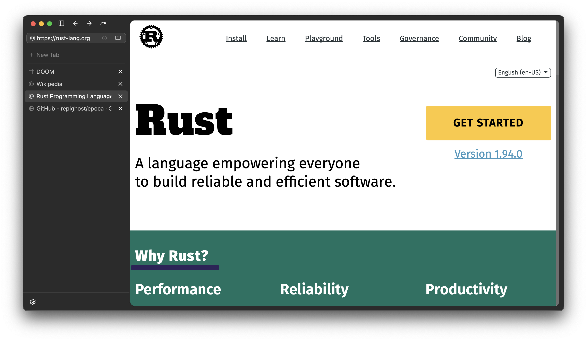

<p align="center">
  
</p>

<h1 align="center">Epoca</h1>

<p align="center">
  A programmable, privacy-first browser built on
  <a href="https://gpui.rs">GPUI</a> and
  <a href="https://polkavm.org">PolkaVM</a>.
  <br />
  UI components by <a href="https://github.com/pierreaubert/sotf/tree/master/crates/gpui-ui-kit">gpui-ui-kit</a>.
  <br />
  Native on macOS. No Electron.
</p>

<p align="center">
  <a href="#install">Install</a> &middot;
  <a href="#features">Features</a> &middot;
  <a href="#building-from-source">Build</a> &middot;
  <a href="#architecture">Architecture</a> &middot;
  <a href="#license">License</a>
</p>

---

<p align="center">
  
</p>

## Install

Build from source (see [below](#building-from-source)).

## Features

**Browsing**
- WebView tabs powered by WKWebView (WebKit)
- Cmd-click to open links in background tabs
- Find in page (Cmd+F)
- Session restore across launches
- Browsing history with configurable retention (session only, 8h, 24h, 7d, 30d)
- Favicon and live page titles in the tab sidebar
- Reader mode for distraction-free article reading

**Privacy**
- Content blocking via WKContentRuleList — blocks before the network request, not after
- EasyList, AdGuard, uBlock Origin, Fanboy, and Peter Lowe filter lists (440k+ rules)
- Per-site shield toggle
- Tab isolation mode — each tab gets its own cookie/storage sandbox
- Session contexts — named browsing sessions with separate data stores
- Cosmetic filtering with element count badge

**Sandboxed Apps (.dot)**
- Run apps as browser tabs in a PolkaVM sandbox
- Framebuffer apps (games, emulators) with full pixel-level rendering
- SPA bundles — sandboxed single-page web apps in `.prod` format
- `.dot` domain resolution — load apps from IPFS via on-chain name registry
- Capability broker controls what each app can access

**Wallet**
- BIP-39 mnemonic key management with encrypted keystore
- Polkadot: Smoldot light client, `window.polkadot` injection
- Ethereum: EIP-191 signing, Helios light client
- Bitcoin: BIP-137 signing, Kyoto light client (compact block filters)
- `window.bitcoin` (Unisat-compatible) and `window.ethereum` bridges

## Building from Source

### Prerequisites

- [Rust](https://rustup.rs) 1.91+
- macOS 13+ (Ventura or later)
- Xcode Command Line Tools: `xcode-select --install`

### Build

```bash
git clone https://github.com/replghost/epoca.git
cd epoca

cargo build -p epoca --release
./target/release/epoca
```

Or use the convenience script:

```bash
./run-release.sh
```

### Run a guest app

```bash
# Open a .prod bundle (sandboxed app)
./target/release/epoca path/to/app.prod

# Open a .dot app from IPFS
./target/release/epoca dot://doomgame.dot

# Open a URL
./target/release/epoca https://example.com
```

## Architecture

```
crates/
  epoca/            binary entry point
  epoca-core/       workbench shell, tabs, sidebar, session management
  epoca-sandbox/    PolkaVM runtime (guest app execution)
  epoca-shield/     content blocking (WKContentRuleList compiler)
  epoca-protocol/   ViewTree serialization (host <> guest)
  epoca-broker/     capability/permission broker
  epoca-dsl/        ZML parser and evaluator
  epoca-chain/      light clients (Polkadot, Ethereum, Bitcoin), DOTNS resolver
  epoca-wallet/     key management and signing
  epoca-hostapi/    host API dispatch (JSON + SCALE transports)
```

## Status

Early release. The core browsing shell works on macOS with content blocking, session restore, and sandboxed app support. Expect rough edges.

## License

[AGPL-3.0](LICENSE)
